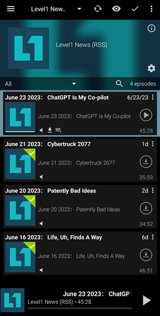

# Youtube channel/playlist to an audio podcast RSS feed
A rudimentary python script to generate an audio podcast feed from a Youtube channel leveraging yt-dlp.

Does not include a web server to serve the files, just generates them - plenty of options available for hosting, e.g. I am using [nginx](https://docs.nginx.com/nginx/admin-guide/web-server/) and have also used [Static Web Server](https://github.com/static-web-server/static-web-server) as a part of containerized apps with great success.

Run the `run.sh` shell script; it grabs/updates the Python dependencies (rather important for yt-dlp as they update to handle changes from Youtube) and then runs the main Python script. Put it in a cron job and schedule it to run once a day or once an hour, depending on the frequency of uploads from your target channel; just be aware of getting throttled if you're polling too frequently.

Dumps the output into the specified directory set in `options.json`. 

	{
		"BASEPATH": "/var/www/html/name_feed",
		"PUBLICURL": "https://web.site/name_feed/",
		"REMOVE_WORDS": ["common words in the titles to remove", "totally optional"],
		"CHANNELID": "channel ID/playlist ID/anything yt-dlp recognizes as a list of videos",
		"matchtitle": "(optionalregextomatchtitles|egPodcast)",
		"download_archive": "downloaded.txt",
		"format": "bestaudio/best",
		"postprocessors": [{
			"key": "FFmpegExtractAudio",
			"preferredcodec": "mp3",
			"preferredquality": "256"
		}],
		"playlistend": 10,
		"outtmpl": "%(upload_date>[%Y%m%d])s %(title)s.%(ext)s"
	}

Modify the contents of `podcasttemplate.rss` to match your target output:

	<rss version="2.0">
	    <channel>
	        <title>Podcast Name (RSS)</title>
	        <description>Podcast description</description>
	        <image>
	            <link>https://web.site/podcastname/</link>
	            <title>Podcast Name (RSS)</title>
	            <url>https://web.site/podcastname/icon.jpg</url>
	        </image>
	        <link>https://web.site/podcastname/</link>
	    </channel>
	</rss>

The `<image>` URL should point to an icon image, as that is what most podcast readers will display.

## Example

`podcasttemplate.rss`

	<rss version="2.0">
	    <channel>
	        <title>Level1 News (RSS)</title>
	        <description>Level1 News - ripped from youtube.</description>
	        <image>
	            <link>https://web.site/level1/</link>
	            <title>Level1 News (RSS)</title>
	            <url>https://web.site/level1/icon.jpg</url>
	        </image>
	        <link>https://web.site/level1/</link>
	    </channel>
	</rss>

`options.json`

	{
		"BASEPATH": "/var/www/html/level1",
		"PUBLICURL": "https://web.site/level1/",
		"REMOVE_WORDS": ["The Level1 Show", "Level1"],
		"CHANNELID": "UU4w1YQAJMWOz4qtxinq55LQ",
		"matchtitle": "(Level1 Show|202)",
		"download_archive": "downloaded.txt",
		"format": "bestaudio/best",
		"postprocessors": [{
			"key": "FFmpegExtractAudio",
			"preferredcodec": "mp3",
			"preferredquality": "256"
		}],
		"playlistend": 10,
		"outtmpl": "%(upload_date>[%Y%m%d])s %(title)s.%(ext)s"
	}

Generated `podcast.rss` - as built, doesn't pretty-print to the .rss file, but that's not really necessary:

	<rss version="2.0">
		<channel>
			<title>Level1 News (RSS)</title>
			<description>Level1 News - ripped from youtube.</description>
			<image>
				<link>https://web.site/level1/</link>
				<title>Level1 News (RSS)</title>
				<url>https://web.site/level1/icon.jpg</url>
			</image>
			<link>https://web.site/level1/</link>
			<item>
				<title>June 16 2023&#65306; Life, Uh, Finds A Way</title>
				<enclosure url="https://web.site/level1/%5B20230616%5D%20June%2016%202023%EF%BC%9A%20Life%2C%20Uh%2C%20Finds%20A%20Way.mp3" type="audio/mpeg" length="89972013" />
				<guid>https://web.site/level1/%5B20230616%5D%20June%2016%202023%EF%BC%9A%20Life%2C%20Uh%2C%20Finds%20A%20Way.mp3</guid>
				<pubDate>16 June 2023 08:00:00 -0000</pubDate>
				<duration>2811</duration>
			</item>
			<item>
				<title>June 20 2023&#65306; Patently Bad Ideas</title>
				<enclosure url="https://web.site/level1/%5B20230620%5D%20June%2020%202023%EF%BC%9A%20Patently%20Bad%20Ideas.mp3" type="audio/mpeg" length="66958125" />
				<guid>https://web.site/level1/%5B20230620%5D%20June%2020%202023%EF%BC%9A%20Patently%20Bad%20Ideas.mp3</guid>
				<pubDate>20 June 2023 08:00:00 -0000</pubDate>
				<duration>2092</duration>
			</item>
			<item>
				<title>June 21 2023&#65306; Cybertruck 2077</title>
				<enclosure url="https://web.site/level1/%5B20230621%5D%20June%2021%202023%EF%BC%9A%20Cybertruck%202077.mp3" type="audio/mpeg" length="69098541" />
				<guid>https://web.site/level1/%5B20230621%5D%20June%2021%202023%EF%BC%9A%20Cybertruck%202077.mp3</guid>
				<pubDate>21 June 2023 08:00:00 -0000</pubDate>
				<duration>2159</duration>
			</item>
			<item>
				<title>June 23 2023&#65306; ChatGPT Is My Co-pilot</title>
				<enclosure url="https://web.site/level1/%5B20230623%5D%20June%2023%202023%EF%BC%9A%20ChatGPT%20Is%20My%20Co-pilot.mp3" type="audio/mpeg" length="87321645" />
				<guid>https://web.site/level1/%5B20230623%5D%20June%2023%202023%EF%BC%9A%20ChatGPT%20Is%20My%20Co-pilot.mp3</guid>
				<pubDate>23 June 2023 08:00:00 -0000</pubDate>
				<duration>2728</duration>
			</item>
		</channel>
	</rss>

And the resulting file structure:

	'[20230616] June 16 2023： Life, Uh, Finds A Way.mp3'
	'[20230620] June 20 2023： Patently Bad Ideas.mp3'
	'[20230621] June 21 2023： Cybertruck 2077.mp3'
	'[20230623] June 23 2023： ChatGPT Is My Co-pilot.mp3'
	download
	downloaded.txt
	export.py
	icon.jpg
	options.json
	podcast.rss
	podcasttemplate.rss

Result as displayed in my podcast app of choice:

